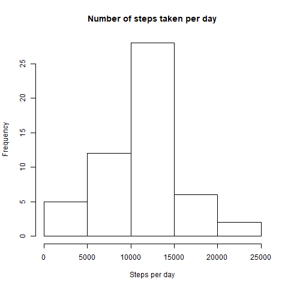
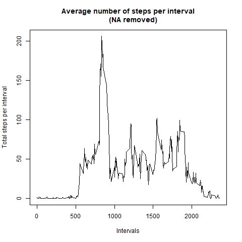
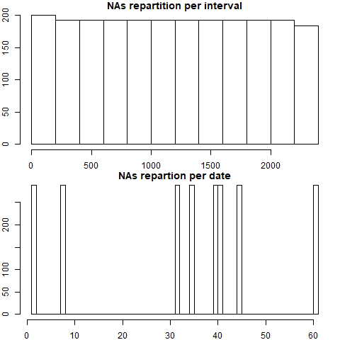
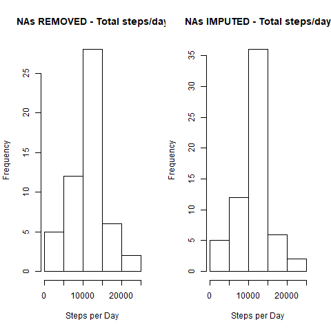
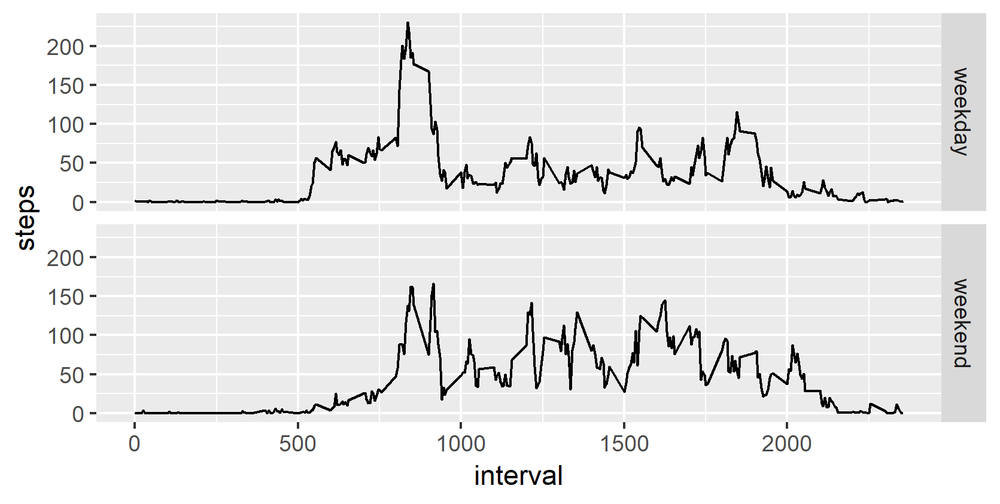

```r
##setup packages
library(dplyr)
```

```
## Warning: package 'dplyr' was built under R version 3.5.3
```

```
## 
## Attaching package: 'dplyr'
```

```
## The following objects are masked from 'package:stats':
## 
##     filter, lag
```

```
## The following objects are masked from 'package:base':
## 
##     intersect, setdiff, setequal, union
```

```r
library(ggplot2)
```

```
## Warning: package 'ggplot2' was built under R version 3.5.3
```

```r
##load data
activity<-read.csv("activity.csv")

##perform calculations
#use aggregate function for ease
steps_per_day<-aggregate(steps ~ date, data = activity, 
                         FUN = sum, na.rm = TRUE)
```


```r
##plot histogram
hist(steps_per_day$steps,xlab="Steps per day",
     main="Number of steps taken per day")
```

<!-- -->



```r
##find mean and median per day
mean_per_day<-format(mean(steps_per_day$steps), digits=1)
median_per_day<-format(median(steps_per_day$steps), digits=1)
```
The mean and median of total number of steps taken per day are 10766 and median_per_day` respectively.


```r
##time series of activity
activity_steps_mean <- aggregate(steps ~ interval, data = activity,
                                 FUN = mean, na.rm = TRUE)
plot(activity_steps_mean$interval, activity_steps_mean$steps, 
     type = "l", xlab = "Intervals", 
     ylab = "Total steps per interval", 
     main = "Average number of steps per interval
     (NA removed)")
```

<!-- -->


```r
max_num_steps<-max(activity_steps_mean$steps)
```
The interval which has the maximum no. of average steps is 206.1698113.


```r
##interpreting missing values
total_missing<-sum(is.na(activity))
```
The number of missing values is 2304.


```r
#filling in missing values
#subset the missing values
missing_values<-subset(activity,is.na(activity$steps))
```


```r
#parition NAs by date and by interval to determine 
#how to account the NAs
par(mfrow = c(2,1), mar = c(2, 2, 1, 1))
hist(missing_values$interval, 
     main="NAs repartition per interval")
hist(as.numeric(missing_values$date), 
     main = "NAs repartion per date", breaks = 61)
```

<!-- -->



```r
#create new dataset filling in NAs
#use mean of steps per interval
mean_per_interval <- tapply(activity$steps, activity$interval, 
                            mean, na.rm = TRUE)
#split activity into w/ and w/o NAs
activity_w_NAs <- activity[is.na(activity$steps),]
activity_wo_NAs <- activity[!is.na(activity$steps),]
```

```r
#replace missing values
activity_w_NAs$steps <- as.factor(activity_w_NAs$interval)
levels(activity_w_NAs$steps) <- mean_per_interval

#make vector an integer
levels(activity_w_NAs$steps) <- 
  round(as.numeric(levels(activity_w_NAs$steps)))
activity_w_NAs$steps <- 
  as.integer(as.vector(activity_w_NAs$steps))
#merge data sets
impute_activity <- rbind(activity_w_NAs, activity_wo_NAs)
```


```r
#histogram of new dataset
par(mfrow = c(1,2))
activity_steps_day <- aggregate(steps ~ date, data = activity, 
                                FUN = sum, na.rm = TRUE)
hist(activity_steps_day$steps, xlab = "Steps per Day",
     main = "NAs REMOVED - Total steps/day")
imp_activity_steps_day <- aggregate(steps ~ date, 
                                    data = impute_activity,
                                    FUN = sum, na.rm = TRUE)

hist(imp_activity_steps_day$steps, 
     xlab = "Steps per Day", 
     main = "NAs IMPUTED - Total steps/day")
```

<!-- -->


```r
#find mean and median
mean_imp<-format(mean(imp_activity_steps_day$steps),digits=1)
median_imp<-format(median(imp_activity_steps_day$steps),digits=1)
```

The mean and median of total number of steps taken per day in the new data (after imputing missing values) are 10766 and 10762 respectively.


```r
##difference between weekdays and weekends
#use imputed activity and split by weekend 
impute_activity$dayType <- ifelse(weekdays(as.Date(impute_activity$date)) == "Saturday" |
                                    weekdays(as.Date(impute_activity$date)) == "Sunday", 
                                  "weekend", "weekday")
#transform day type into a factor
impute_activity$dayType <- factor(impute_activity$dayType)
#create time series panel plot
steps_interval_dayType <- aggregate(steps ~ interval + dayType, 
                                    data = impute_activity, FUN = mean)
```


```r
#plot using ggplot
day_type_plot <- ggplot(steps_interval_dayType, aes(interval, steps))+
  geom_line() + facet_grid(dayType~.)
plot(day_type_plot)
```

<!-- -->

